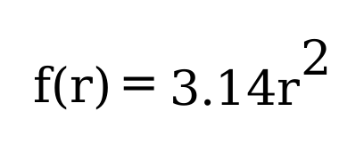

Functions
=========

   *Either mathematics is too big for the human mind, or the human mind
   is more than a machine.* — Kurt Gödel

In this chapter, we are going to learn more about functions. You have
already seen functions in previous chapters. Functions provide a way to
group statements together and call it multiple times. If you don’t use
functions, the same statements will be written again and again in
different parts of your code. Ultimately functions helps you to reuse
code. A function can optionally accept arguments and execute statements
and optionally return values.

Mathematical function would be a good analogy to understand the concept
of functions in programming. We have seen this mathematical function in
the Quick Start chapter.

   Figure 5.1: Mathematical function for area of a circle

This function square the input value and multiply with 3.14. Depending
on the input value the output varies.

.. figure:: _static/function/blackbox.png

   Figure 5.2: Blackbox representation of a function

As you can see in the diagram, ``r`` is the input and ``y`` is the
output. A function in Go can take input arguments and perform actions
and return values. A minimal implementation of this function in Go looks
like this.

::

   func Area(r float64) float64 {
       return 3.14 * r * r
   }

The function declaration starts with ``func`` keyword. In the above
example, ``Area`` is the function name which can be later used to call
the function. The arguments that can be received by this function is
given within brackets. After the input parameters you can specify the
output parameters. If there are more than one output parameter required,
use a bracket around that. After the output parameters, add one opening
curly bracket. The statements can be written in the next line on wards
until the closing curly bracket. It is recommended to start a new line
after the opening curly bracket and closing bracket can be in a line by
its own.

Here is a complete example with usage of the Area function.

::

   package main

   import "fmt"

   func Area(r float64) float64 {
       return 3.14 * r * r
   }

   func main() {
       area := Area(5.0)
       fmt.Println(area)
   }

In the above example, the ``Area`` function is called with argument
value as ``5.0`` (line number 10). And the short variable declaration
syntax is used to assign value returned by the function. The type of the
variable ``area`` will be ``float64`` as the ``Area`` function returns
with that type.

If you run the above program, you will get the output like this:

::

   $ go run area.go
   78.5

Parameters
----------

A function can accept any number of arguments depending on the
parameters defined. The ``Area`` function in the previous section
accepts one argument.

If the function definition doesn’t have any parameters, you cannot pass
any arguments. Parameter is the variable used in the declaration of a
function. Where as argument is the actual value of this variable that
gets passed to function. Consider this example:

::

   package main

   import (
        "fmt"
        "time"
   )

   func TimeNow() string {
        t := time.Now()
        h := t.Hour()
        m := t.Minute()
        return fmt.Sprintf("%d:%d", h, m)
   }

   func main() {
        now := TimeNow()
        fmt.Println(now)
   }

The ``TimeNow`` function doesn’t declare any parameters. So, when the
function is called, no arguments are passed. If you try to pass any
arguments, you will get an error with this message:
``too many arguments in call to TimeNow``.

More parameters
~~~~~~~~~~~~~~~

A function can accepts more arguments of same or different types.

::

   package main

   import "fmt"

   func sum(a int, b int) int {
       return a + b
   }

   func main() {
       s := sum(5, 2)
       fmt.Println(s)
   }

The above ``sum`` function accepts two integer parameters. Since both
parameters are integers, the type can be specified once.

::

   func sum(a, b int) int {
       return a + b
   }

Return Values
-------------

A function can return any number of values. The calling side should have
comma separated variables to receive the return values. If you are only
interested in a particular return value, you can use underscore as the
variable name for others.

Here is an example function which return two values:

::

   package main

   import "fmt"

   func div(a, b int) (int, int) {
       return a / b, a % b
   }

   func main() {
       v, r := div(5, 2)
       fmt.Println(v, r)
   }

In the above example, the div function return two values. So two
variables are used to assign the values. If you use one variable it will
produce compile time error. The compile time error will be produced, if
more than two variables are used to assigned. However, it is possible to
call the function without assigning to any variables.

::

   v, _ := div(5, 2)
   div(5, 2)

By convention, the last return value will be an error value. Here is a
modified example.

::

   func div(a, b int) (int, int, error) {
       if b == 0 {
           err := errors.New("Zero division error")
           return 0, 0, err
       }
       return a / b, a % b, nil
   }

In the above example, package ``errors`` is used to create a new error
value. If there is no error, a ``nil`` value can be returned.

Named output parameters
~~~~~~~~~~~~~~~~~~~~~~~

It is possible to specify name for output parameters. These variables
can be used to assign values. With named output parameters, return
statement need not to explicitly specify the variables.

::

   package main

   import "fmt"

   func div(a, b int) (int d, int r) {
       d := a / b
       r := a % b
       return
   }

   func main() {
       v, r := div(5, 2)
       fmt.Println(v, r)
   }

Variadic Functions
------------------

A function which can receive any number of arguments of a particular
type is called variadic function. Variable name along with an ellipsis
(``...``) symbol is used to declare variadic parameters. The
``fmt.Println`` is a commonly used variadic function.

Here is a complete example:

::

   package main

   import "fmt"

   func sum(nums ...int) {
       fmt.Printf("%#v ", nums)
       total := 0
       for _, num := range nums {
           total += num
       }
       fmt.Println(total)
   }

   func main() {
       sum(1, 2)
       sum(1, 2, 3)
       nums := []int{1, 2, 3, 4}
       sum(nums...)
   }

If you run the above program, this will be the output:

::

   $ go run variadic.go
   []int{1, 2} Sum: 3
   []int{1, 2, 3} Sum: 6
   []int{1, 2, 3, 4} Sum: 10

As you can see the arguments are captured into a slice. You can send
values in a slice to a variadic function using the ellipsis syntax as a
suffix.

Anonymous Functions
-------------------

It is possible to declare a function without a name. These type of
functions can be used to create function closures. A closure is an
anonymous function that access variables from outside its body.

::

   package main

   import "fmt"

   func main() {
        name := "Tom"
        func() {
               fmt.Println("Hello", name)
        }()
   }

Function as Value
-----------------

Function is a first class citizen in Go, so it can be passed as an
argument and return as a value.

::

   package main

   import "fmt"

   func Greeting(msg string) func(name string) string {
   }

   func main() {
        name := "Tom"
        func() {
               fmt.Println("Hello", name)
        }()
   }

.. _`sec:methods`:

Methods
-------

A function can be associated with a type, that is called method.
Additional methods can be added to types defined locally. However,
adding additional methods for non-local type is not allowed. Here is an
example program:

::

   package main

   import (
           "fmt"
           "os"
           "strconv"
   )

   type Number int

   func (num Number) Even() bool {
           if num%2 == 0 {
                   return true
           } else {
                   return false
           }

   }

   func main() {
           i := os.Args[1]
           n, err := strconv.Atoi(i)
           if err != nil {
                   fmt.Println("Not a number:", i)
                   os.Exit(1)
           }
           num := Number(n)
           fmt.Println(num.Even())
   }

In the above program, a custom type named ``Number`` is defined. Later a
method named ``Even`` is defined below. To define a method for any type,
the syntax is like this: ``func (value CustomType) MethodName()``. You
can also define input parameters and output parameters. In the above the
output parameter is given as a ``bool`` value.

You can associate methods to structs. Consider this struct:

::

   type Rectangle struct {
       Width  float64
       Height float64
   }

If you want methods to calculate area and perimeter for this rectangle,
you can define methods like this:

::

   func (r Rectangle) Area() float64 {
       return r.Width * r.Height
   }

   func (r Rectangle) Perimeter() float64 {
       return 2 * (r.Width * r.Height)
   }

You can call these methods from the struct initialized using the
``Rectangle`` struct. Here is an example:

::

   r := Rectangle{3.0, 5.0}
   area := r.Area()
   perimeter := r.Perimeter()

When a function is bound to a type, it is called method. The type that
is bound is called receiver. A receiver could be any type with a name.
When you declare a method, it is defined using receiver argument. The
receiver argument points to the type where the method will be available.
The receiver argument is specified between func keyword and the method
name inside a bracket with a name.

Methods can be defined only on types declared in the same package.
Declaring a method on built-in type is also illegal.

Here is an example:

::

   package main

   import "fmt"

   type Circle struct {
       radius float64
   }

   func (c Circle) Area() float64 {
       return 3.14 * c.radius * c.radius
   }

   func main() {
        c := Circle{3.4}
        a := c.Area()
        fmt.Println(a)
   }

In the above example, the method ``Area`` calculate area for a circle.

The receiver could be pointer also. Here is a modified example with
pointer receiver:

.. code-block:: go
   :linenos:

   package main

   import "fmt"

   type Circle struct {
       radius float64
   }

   func (c *Circle) Area() float64 {
       return 3.14 * c.radius * c.radius
   }

   func main() {
       c1 := Circle{3.4}
       a1 := c1.Area()
       fmt.Println(a1)

       c2 := &Circle{3.4}
       a2 := c2.Area()
       fmt.Println(a2)

   }

In the above example, the ``Area`` method is using a pointer receiver.
When creating object, you can create a normal value or a pointer value.
Calling the ``Area`` can use either a normal value or a pointer value.

Pointer receiver can be used when for any of these three reason:

-  To modify the receiver itself by changing the value of attributes.

-  The object is very large and a passing a deep copy is expensive.

-  Consistency: Let all methods have pointer receivers.

You can use new function to allocate memory for *struct*:

::

   type Temperature struct{
        Value float64
   }

   name := new(Temperature)

In the above example, the zero value is allocated and assigned to the
variable ``name``. But in some cases, zero value is not what you
required. So you can use ``&`` to with struct syntax like this:

::

   type Temperature struct{
        Value float64
   }

   name := &Temperature{Value: -7.6}

As you can see, the temperature value is set to ``-7.6`` and assigned to
the variable.

Exercises
---------

**Exercise 1:** Write a method to calculate the area of a rectangle for
a given struct with width and height.

**Solution:**

::

   type Rectangle struct {
       Width  float64
       Height float64
   }

   func (r Rectangle) Area() float64 {
       return r.Width * r.Height
   }

Additional Exercises
~~~~~~~~~~~~~~~~~~~~

Answers to these additional exercises are given in the Appendix A.

**Problem 1:** Write a program with a function to calculate the
perimeter of a circle.

Summary
-------

This chapter explained the main features of functions in Go. It covered
how to send input parameters and receive return values. It also
explained about variadic functions and anonymous functions. This chapter
briefly covered methods. The next chapter will cover interfaces. Along
with that, we will learn more about methods.

Brief summary of key concepts introduced in this chapter:

-  Functions are used to group together related code and make it easier
   to read and understand. They can also be used to reuse code in
   different parts of a program.

-  Input parameters are values that are passed into a function when it
   is called. Return values are values that are returned by a function
   when it finishes executing.

-  Variadic functions are functions that can accept a variable number of
   input parameters. Anonymous functions are functions that are defined
   without a name.

-  Methods are functions that are associated with a specific type. They
   can be used to operate on objects of that type.
