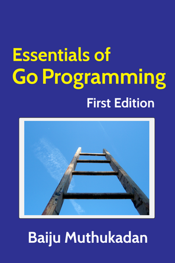

.. Essentials of Go Programming documentation master file, created by
   sphinx-quickstart on Wed Jun  7 12:58:30 2023.
   You can adapt this file completely to your liking, but it should at least
   contain the root `toctree` directive.

Essentials of Go Programming
============================

.. toctree::
   :numbered:
   :maxdepth: 2
   :hidden:

   introduction
   quickstart
   control-structures
   data-structures
   functions
   interfaces
   concurrency
   packages
   io
   testing
   tooling
   answers

.. include:: preface.rst
.. include:: acknowledgements.rst
.. include:: colophon.rst

