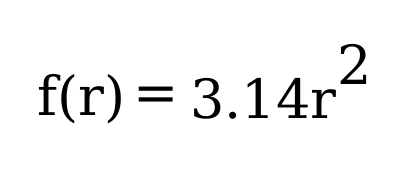
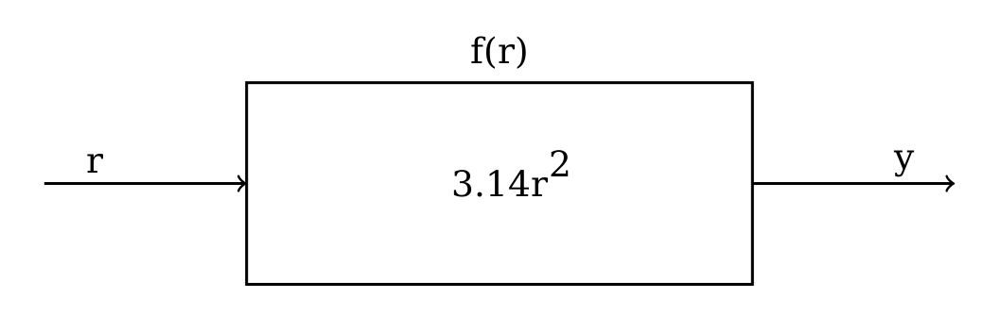

Quickstart
==========

   *Software engineering is what happens to programming when you add
   time, and other programmers.* – Russ Cox

This chapter walks through few basic topics in Go. You should be able to
write simple programs using Go after reading and practicing the examples
given in this chapter. The next 3 sections revisit the hello world
program introduced in the last chapter. Later we will move on to few
basic topics in Go. We will learn about data types, variables, comments,
For loop, range clause, If, functions, operators, slices and maps.

Hello World!
------------

Here is the hello world program introduced in the previous chapter. You
can type the below code to your favorite text editor and save it as
``hello.go``. This program will print a message, ``Hello, World!`` into
your console/terminal.

.. code-block:: go
   :linenos:

   package main

   import "fmt"

   func main() {
       fmt.Println("Hello, World!")
   }

You can open your command line program and run the above program like
this::

::

   $ go run hello.go
   Hello, World!

What you wrote in the ``hello.go`` is a structured document. The
characters, words, spaces, line breaks and the punctuation characters
used all are important. In fact, we followed the "syntax" of Go
language. According to Wikipedia, the syntax of a computer language is
the set of rules that defines the combinations of symbols that are
considered to be a correctly structured document or fragment in that
language.

The ``go run`` command is easy to use when developing programs. However,
when you want to use this program in production environment, it is
better to create executable binaries. The next section briefly explain
the process of building executable binaries and running it.

Building and Running Programs
-----------------------------

You can use the ``go build`` command to compile the source and create
executable binary programs. Later this executable can run directly or
copied to other similar systems and run.

To compile (build) the hello world program, you can use this command:

::

   $ go build hello.go

This command produce an an executable file named ``hello`` in the
current directory where you run the ``build`` command. And you can run
this program in a GNU/Linux system as given below. The ``./`` in the
beginning of the command ensure that you are running the ``hello``
program located in the current directory:

::

   $ ./hello
   Hello, World!

In Windows, the executable file name ends with ``.exe``. This is how you
can run the executable in Windows:

::

   C:\> hello.exe
   Hello, World!

The ``go build`` command produce a binary file native to the operating
system and the architecture of the CPU (i386, x86_64, arm etc.)

The Example Explained
---------------------

The first line is a clause defining the name of the package to which the
file belongs. In the above hello world program, the ``hello.go`` file
belongs to the the ``main`` package because of this clause at the
beginning of the file:

::

   package main

A package is a collection of Go source files. Package sources can be
spread across multiple source files in a directory. If you want to
produce an executable from your program, the name of package should be
named as ``main``. Always use lowercase letters for the package names.

The second line has kept as blank for readability. The 3rd line is an
``import`` declaration. The ``import`` declaration enable accessing
external packages from the current package. In the above example,
``fmt`` package is imported like this.

::

   import "fmt"

If a package is imported, it must be used somewhere in the source files.
Otherwise, the compiler will produce an error. As you can see above, the
import declaration starts with a word ``import`` followed by the name of
the package in double quotes. If multiple packages need be imported, you
can group the imports into a parenthesis (factored import) to reduce
typing. Here is an example for factored import:

::

   import (
       "fmt"
       "math"
   )

The name of the package for the built-in packages will be the name given
within quotes of the import statement. If the import string is a path
separated by slash, then name of the package will be the last part of
the string. For example, "net/http" package name is ``http``. For other
third party vendor packages, the name should be verified within the
source code.

Names within the imported package can be referred using a dot operator
as you can see above: ``fmt.Println``. A name is considered as exported
if it begins with a capital letter. For example, the name ``Area`` is an
exported name, but ``area`` is not exported.

The https://go.dev/play site can be used to share Go source code
publicly. You can also run the programs in the playground.

Again we have added one blank line after the import statement for
readability. The fifth line starts with a function definition. In this
case, this is a special function named ``main``. A function is a
collection of instructions or more specifically statements. A function
definition starts with ``func`` keyword followed by function name then
arguments (parameters) for the function within parenthesis and finally
statements within curly brackets. The ``main`` function is a special
function which doesn’t accept any arguments. The starting curly bracket
should be in the same line where function definition started and
statements should start in the next line. There should be only one
``main`` function for an executable program.

Inside the main function, we are calling the ``Println`` function
available inside the ``fmt`` package.

::

   fmt.Println("Hello, World!")

The above function call is a complete statement in Go. The ``Println``
function print the string into standard output of the terminal/console
and also add a new line at the end of the string.

Organizing Code
---------------

As mentioned above, a package is a collection of Go source files.
Package sources can be spread across multiple source files in a
directory. For a given package, all the variables, functions, types, and
constants defined in one source file can be directly referrenced from
other sources files.

A Git repository normally contain one module, located at the root,
however it is possible to add more than one, if necessary. A Go module
is a collection of Go packages that are released together.

To understand the code organization, you also need to understand about
Go module. A file named go.mod there declares the module path: the
import path prefix for all packages within the module. The module
contains the packages in the directory containing its go.mod file as
well as subdirectories of that directory, up to the next subdirectory
containing another go.mod file (if any).

Note that you don’t need to publish your code to a remote repository
before you can build it. A module can be defined locally without
belonging to a repository. However, it’s a good habit to organize your
code as if you will publish it someday.

Each module’s path not only serves as an import path prefix for its
packages, but also indicates where the go command should look to
download it. For example, in order to download the module
golang.org/x/tools, the go command would consult the repository
indicated by https://golang.org/x/tools (described more here).

An import path is a string used to import a package. A package’s import
path is its module path joined with its subdirectory within the module.
For example, the module github.com/google/go-cmp contains a package in
the directory cmp/. That package’s import path is
github.com/google/go-cmp/cmp. Packages in the standard library do not
have a module path prefix.

Basics
------

Data Types
~~~~~~~~~~

Data is unorganized facts that requires processing. In programming, the
data is processed and organized to be useful. Data type provides a
classification for the data. Date type is often simply called as *type*.
Data type is one of the fundamental concept in any programming language.
In most of the places in this book, we will say data as "value". More
advanced data type is often called data structures.

Consider an example, you want to work with names of toys in your
programs. So, the values of the "names of toys" is the data. The data
type that you can use to represent this data is called "string". If you
are literally writing a string in Go, you can use a double quote around
the names like this:

::

   "Sheriff Woody"
   "Buzz Lightyear"
   "Jessie"

In the hello world example, we used the string "Hello, World!"
literally. Representation of a string value within source code is called
string literal.

Consider a related example, you want to mark whether the toys are male
or not. This type of data is called Boolean data. So, if the toy is
male, the value will be ``true`` otherwise ``false`` as given below:

::

   {"Sheriff Woody",  true}
   {"Buzz Lightyear", true}
   {"Jessie",        false}

Apart from *string*, and *bool*, Go has some other data types like
*int*, *byte*, *float64* etc.

Variables
~~~~~~~~~

Let’s go back to the hello world example, if you want to print the hello
world message three times. You will be required to write that sentence
three times as given below.

.. code-block:: go
   :linenos:

   package main

   import "fmt"

   func main() {
       fmt.Println("Hello, World!")
       fmt.Println("Hello, World!")
       fmt.Println("Hello, World!")
   }

This is where the concept called *variable* becoming useful. Instead of
using the literal string three times, you can use a short variable name
to refer that string value. The variable is like an alias referring to
the data. The name of the variable is considered as an identifier for
the variable. Consider the example below where a variable named ``hw``
is used to refer the "Hello, World!" string literal.

::

   package main

   import "fmt"

   func main() {
       hw := "Hello, World!"
       fmt.Println(hw)
       fmt.Println(hw)
       fmt.Println(hw)
   }

As you can see in the above example, we are using two special characters
(``:=``) in between the variable name and the string literal. The colon
character immediately followed by equal character is what you can use to
define a short variable declaration in Go. However, there is a small
catch here, the this short syntax for declaring variable will only work
inside a function definition. The Go compiler identify the type of
variable as string. This process of identifying data type automatically
is called *type inference*.

To assign a new value to the variable, you can use ``=`` as given in the
below example:

::

   package main

   import "fmt"

   func main() {
       hw := "Hello, World!"
       fmt.Println(hw)
       hw = "Hi, New World!"
       fmt.Println(hw)
   }

The output will look like this:

::

   $ go run t4.go
   Hello, World!
   Hi, New World!

You can also explicitly define the type of variable instead of using the
``:=`` syntax. To define the type of a variable, you can use the keyword
``var`` followed by the name of the type. Later, to assign a string
value for the ``hw`` variable, you can use ``=`` symbol instead of
``:=``. So, the example we can rewrite like this.

::

   package main

   import "fmt"

   func main() {
       var hw string
       hw = "Hello, World!"
       fmt.Println(hw)
       fmt.Println(hw)
       fmt.Println(hw)
   }

The variable declared outside the function (package level) can access
anywhere within the same package.

Variables declared at the function level must be used. Otherwise, the
compiler is going to throw an error during compilation.

The keyword *var* can used to declare more than one variable. You can
also assign values along with ``var`` declaration. Unlike ``:=`` syntax
give above, the variable declaration using *var* keyword can be at
package level or inside function.

Here are different ways how you can declare a variable:

::

   var variable type
   var variable type = value
   var variable = value
   var variable1, variable2 type = value1, value2

If value is not given, a default "zero" value will be assigned. The zero
value is: 0 for numeric types (int, int32 etc.), false for Boolean type,
and empty string for strings.

Here are a few examples.

::

   var name string
   var age int = 24
   var length = 36
   var width, height int = 3, 6

The same examples using short declaration look like this.

::

   name := ""
   age := 24
   length := 36
   width, height := 3, 6

We used names like ``hw``, ``name``, ``age``, ``length`` etc. as
identifiers for variables. An identifier should start with an alphabet
or underscore, and it can contain digits afterwards. But there are
certain reserved words called keywords which are not allowed to be used
as identifiers. We have already seen some keywords like ``package``,
``import``, ``func`` and ``var``. In the next few sections, we are going
to see some more keywords like ``for``, ``if`` etc. These keywords has
special meaning in the language.

Comments
~~~~~~~~

Writing documentation helps the users to understand the code better. Go
provides syntax to write documentation in the form of comments. The
comments will be written along with source code. Comments are ignored by
the compiler. Usually comments are written for two purpose:

-  To explain complex logic or remarks about part of code

-  Application programming interface (API) documentation

There are two kinds of comments, the one form is a multi-line comment
and the other form only allows single line comment.

The multi-line comment starts with ``/*`` and ends with ``*/``. And
everything in between is considered as comments.

Here is a multi-line comment to document the package named ``plus``. As
you can see here, the comment is used to give a brief description about
the package and two example usages are also given.

::

   /*
   Package plus provides utilities for Google+
   Sign-In (server-side apps)

   Examples:

     accessToken, idToken, err := plus.GetTokens(code, clientID,
                                                       clientSecret)
     if err != nil {
         log.Fatal("Error getting tokens: ", err)
     }

     gplusID, err := plus.DecodeIDToken(idToken)
     if err != nil {
         log.Fatal("Error decoding ID token: ", err)
     }
   */
   package plus

The other form of comments is inline comments and it starts with two
forward slashes (``//``). All the characters till end of line is treated
as comments. Even if you have any valid code within comment, it will not
be considered by compiler to produce the executable binary. Here is an
example line comment:

.. code-block:: go
   :linenos:

   // SayHello returns wishing message based on input
   func SayHello(name string) string {
   	if name == "" { // check for empty string
   		return "Hello, World!"
   	} else {
   		return "Hello, " + name + "!"
   	}
   }

In the above example the first line is a line comment. The “godoc” and
similar tool treated this comment as an API documentation.

There is another comment in the line where name equality with empty
string is checked. These kind of comment helps the reader of source code
to understand what that attribute is used for.

For Loop
~~~~~~~~

Repeating certain process is a common requirement in programming. The
repetition process aiming a result is called iteration. In Go, the
iteration is performed by using the ``for`` loop block.

In the previous section about variable, we printed the ``Hello, World!``
message three times. As you can see there, we repeatedly printed the
same message. So, instead of typing the same print statement again and
again, we can use a ``for`` loop as given below.

::

   package main

   import "fmt"

   func main() {
       hw := "Hello, World!"
       for i := 0; i < 3; i++ {
           fmt.Println(hw)
       }
   }

The for loop starts with a variable initialization, then semi-colon,
then a condition which evaluate ``true`` or ``false``, again one more
semi-colon and an expression to increment value. After these three
parts, the block starts with a curly bracket. You can write any number
of statements within the block. In the above example, we are calling the
``Println`` function from ``fmt`` package to print the hello world
message.

In the above example, the value ``i`` was initialized an integer value
of zero. In the second part, the condition is checking whether the value
of ``i`` is less than 3. Finally, in the last part, the value of ``i``
is incremented by one using the ``++`` operator. We will look into
operators in another section later in this chapter.

Here is another example ``for`` loop to get sum of values starting from
0 up to 10.

::

   package main

   import "fmt"

   func main() {
       sum := 0
       for i := 0; i < 10; i++ {
           sum += i
       }
       fmt.Println(sum)
   }

The initialization and increment part are optional as you can see below.

::

   package main

   import "fmt"

   func main() {
       sum := 1
       for sum < 1000 {
           sum += sum
       }
       fmt.Println(sum)
   }

An infinite loop can be created using a ``for`` without any condition as
given below.

::

   package main

   func main() {
       for {
       }
   }

If
~~

One of the common logic that is required for programming is branching
logic. Based on certain criteria you may need to perform some actions.
This could be a deviation from normal flow of your instructions. Go
provides ``if`` conditions for branching logic.

Consider a simple scenario, based on money available you want to buy
vehicles. You want to buy a bike, but if more money is available you
also want to buy a car.

::

   package main

   import "fmt"

   func main() {
       money := 10000
       fmt.Println("I am going to buy a bike.")
       if money > 15000 {
           fmt.Println("I am also going to buy a car.")
       }
   }

You can save the above program in a file named ``buy.go`` and run it
using ``go run``. It’s going to print like this:

::

   $ go run buy.go
   I am going to buy a bike.

As you can see, the print statement in the line number 9 didn’t print.
Because that statement is within a condition block. The condition is
``money > 15000``, which is not correct. You can change the program and
alter the money value in line number 7 to an amount higher than 15000.
Now you can run the program again and see the output.

Now let’s consider another scenario where you either want to buy a bike
or car but not both. The ``else`` block associated with ``if`` condition
will be useful for this.

::

   package main

   import "fmt"

   func main() {
       money := 20000
       if money > 15000 {
           fmt.Println("I am going to buy a car.")
       } else {
           fmt.Println("I am going to buy a bike.")
       }
   }

You can save the above program in a file named ``buy2.go`` and run it
using ``go run``. It’s going to print like this:

::

   $ go run buy2.go
   I am going to buy a car.

Similar to ``for`` loop, the ``if`` statement can start with a short
statement to execute before the condition. See the example given below.

::

   package main

   import "fmt"

   func main() {
       if money := 20000; money > 15000 {
           fmt.Println("I am going to buy a car.")
       } else {
           fmt.Println("I am going to buy a bike.")
       }
   }

A variable that is declared along with ``if`` statement is only
available within the ``if`` and ``else`` blocks.

Function
~~~~~~~~

Function is a collection of statements. Functions enables code
reusability. Function can accept arguments and return values. To
understand the idea, consider this mathematical function:

   Figure 2.1: Mathematical function for area of a circle

This function square the input value and multiply with 3.14. Depending
on the input value the output varies.

   Figure 2.2: Blackbox representation of a function

As you can see in the above diagram, ``r`` is the input and ``y`` is the
output. A function in Go can take input arguments and perform actions
and return values. A simple implementation of this function in Go looks
like this.

::

   func Area(r float64) float64 {
       return 3.14 * r * r
   }

The function declaration starts with ``func`` keyword. In the above
example, ``Area`` is the function name which can be later used to call
the function. The arguments that can be received by this function is
given within brackets. The line where function definition started should
end with an opening curly bracket. The statements can be written in the
next line on wards until the closing curly bracket.

Here is a complete example with usage of the Area function.

::

   package main

   import "fmt"

   // Area return the area of a circle for the given radius
   func Area(r float64) float64 {
       return 3.14 * r * r
   }

   func main() {
       area := Area(5.0)
       fmt.Println(area)
   }

In the above example, the ``Area`` function is called in line number 11
with an argument of ``5.0``. We are using the short variable
declaration. The type of the variable ``area`` will be ``float64`` as
the ``Area`` function returns with that type.

Operators
~~~~~~~~~

Programming languages use operators to simplify the usage. Operators
behave more or less like functions. More specifically, operators combine
operands to form expressions. We have already seen few operators like
``:=``, ``=``, ``+=``, ``++``, ``*``, ``>`` and ``<``.

The ``:=``, ``=``, ``+=`` are assignment operators. The ``*`` is the
multiplication operator. The ``>`` and ``<`` are comparison operators.

Sometimes logical conditions should be checked to proceed with certain
steps. Logical operators does these kind kind of checking. Let’s say you
want to check whether a particular value is divisible by 3 and 5. You
can do it like this.

::

   if i%3 == 0 {
       if i%5 == 0 {
           // statements goes here
       }
   }

The same thing can be achieved using conditional AND logical operator
(``&&``) like this.

::

   if i%3 == 0 && i%5 == 0 {
       // statements goes here
   }

Apart from the conditional AND, there are conditional OR (``||``) and
NOT (``!``) logical operators. We will see more about operators in the
next chapter.

Slices
~~~~~~

Slice is a sequence of values of the same type. In computer science
terminology, it’s a homogeneous aggregate data type. So, a slice can
contain elements of only one type of data. However, it can hold a
varying number of elements. It can expand and shrink the number of
values. ``[]T`` is a slice with elements of type T.

The number of values in the slice is called the length of that slice.
The slice type ``[]T`` is a slice of type ``T``. Here is an example
slice of color names:

::

   colors := []string{"Red", "Green", "Blue"}

In the above example, the length of slice is ``3`` and the slice values
are string data. The ``len`` function gives the length of slice. See
this complete example:

::

   package main

   import "fmt"

   func main() {
       colors := []string{"Red", "Green", "Blue"}
       fmt.Println("Len:", len(colors))
       for i, v := range colors {
           fmt.Println(i, v)
       }
   }

If you save the above program in a file named ``colors.go`` and run it,
you will get output like this:

::

   $ go run colors.go
   Len: 3
   0 Red
   1 Green
   2 Blue

The ``range`` clause loop over through elements in a variety of data
structures including slice and map. Range gives index and the value. In
the above example, the index is assigned to ``i`` and value to ``v``
variables. As you can see above, each iteration change the value of
``i`` & ``v``.

If you are not interested in the index but just the value of string, you
can use blank identifier (variable). In Go, underscore is considered as
blank identifier which you need not to define and you can assign
anything to it. See the example written below to print each string
ignoring the index.

::

   package main

   import "fmt"

   func main() {
       colors := []string{"Red", "Green", "Blue"}
       fmt.Println("Len:", len(colors))
       for _, v := range colors {
           fmt.Println(v)
       }
   }

If you just want to get the index without value, you can use just use
one variable to the left of range clause as give below.

::

   package main

   import "fmt"

   func main() {
       colors := []string{"Red", "Green", "Blue"}
       fmt.Println("Len:", len(colors))
       for i := range colors {
           fmt.Println(i, colors[i])
       }
   }

In the above example, we are accessing the value using the index syntax:
``colors[i]``.

Maps
~~~~

Map is another commonly used complex data structure in Go. Map is an
implementation of hash table which is available in many very high level
languages. The data organized like key value pairs. A typical map type
looks like this:

::

   map[KeyType]ValueType

A ``KeyType`` can be any type that is comparable using the comparison
operators. The ``ValueType`` can be any data type including another map.
It is possible add any numbers of key value pairs to the map.

Here is a map definition with some values initialized.

::

   var fruits = map[string]int{
         "Apple":  45,
         "Mango":  24,
         "Orange": 34,
     }

To access a value corresponding to a key, you can use this syntax:

::

   mangoCount := fruits["Mango"]

If the key doesn’t exist, a zero value will be returned. For example, in
the below example, value of ``pineappleCount`` is going be ``0``.

::

   pineappleCount := fruits["Pineapple"]

More about maps will be explained in the data structure chapter.

Exercises
---------

**Exercise 1:** Print multiples of 5 for all even numbers below 10

**Solution:**

This exercise requires getting all even numbers numbers below 10. As we
we have seen above, a ``for`` loop can be used to get all numbers. Then
``if`` condition can be used with ``%`` operator to check whether the
number is even or not. The ``%`` operator given the gives the remainder
and we can check it is zero or not for modulus 2. If the number is even
use the ``*`` operator to multiply with 5.

Here is the program.

::

   package main

   import "fmt"

   func main() {
       for i := 1; i < 10; i++ {
           if i%2 == 0 {
               fmt.Println(i * 5)
           }
       }
   }

**Exercise 2:** Create a function to reverse a string

**Solution:**

::

   package main

   import "fmt"

   func Reverse(s string) string {
       var r string
       for _, c := range s {
           r = string(c) + r
       }
       return r
   }

   func main() {
       hw := "Hello, World!"
       rhw := Reverse(hw)
       fmt.Println(rhw)
   }

**Exercise 3:** Find sum of all numbers below 50 completely divisible by
2 or 3 (i.e., remainder 0).

Hint: The numbers completely divisible by 2 or 3 are 2, 3, 4, 6, 8, 9
... 45, 46, 48.

**Solution:**

::

   package main

   import "fmt"

   func main() {
       sum := 0
       for i := 1; i < 50; i++ {
           if i%2 == 0 {
               sum = sum + i
           } else {
               if i%3 == 0 {
                   sum = sum + i
               }
           }
       }
       fmt.Println("Sum:", sum)
   }

The logic can be simplified using a conditional OR operator.

::

   package main

   import "fmt"

   func main() {
       sum := 0
       for i := 1; i < 50; i++ {
           if i%2 == 0 || i%3 == 0 {
               sum = sum + i
           }
       }
       fmt.Println("Sum:", sum)
   }

Additional Exercises
~~~~~~~~~~~~~~~~~~~~

Answers to these additional exercises are given in the Appendix A.

**Problem 1:** Write a function to check whether the first letter in a
given string is capital letters in English (A,B,C,D etc).

Hint: The signature of the function definition could be like this:
``func StartsCapital(s string) bool``. If the function returns ``true``,
the string passed starts with a capital letter.

**Problem 2:** Write a function to generate Fibonacci numbers below a
given value.

Hint: Suggested function signature: ``func Fib(n int)``. This function
can print the values.

Summary
-------

We started with a hello world program and briefly explained it. Then
this chapter introduced few basic topics in Go programming language. We
have covered Data Types, Variables, Comments, For Loop, Range Clause,
If, Function, Operators, Slices, and Maps. The next chapters will
explain the fundamental concepts in more detail.
